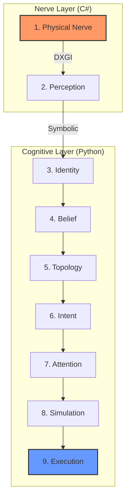

# 🌌 HSGF: Hiro Sovereign Gravity Framework (V9.2)

> **"Giving Machines the Instinct to Survive through Mathematical Semantics."**  
> **「賦予機器生存的直覺。」**

HSGF 並不依賴於複雜的視覺語言模型 (VLM)，而是運用純粹的數學物理原理——包括**引力場計算**、**拋物線軌道預測**以及**香農熵 (Shannon Entropy) 控制機制**。

---

## 🧠 9-Layer Cognitive Stack (認知架構)

V9.2 引入了完整的解耦式認知堆疊，確保系統在低功耗筆記本上依然能實現超高性能的「感知-決策-執行」閉環。



### 📋 核心感知維度 (Perceptive Trinity)
| 維度 | 技術核心 | 戰術作用 |
| :--- | :--- | :--- |
| **數理語意** | 空間引力場權重計算 | 將像素轉化為具備「質量」的動態向量。 |
| **符號數字** | 局部香農熵偵測 | 鎖定高資訊密度區域（如 UI 變化、敵方特徵）。 |
| **幾何圖形** | 幾何哈希 (Geo-Hash) | 實時識別圓形、矩形，實現無訓練數據的鎖定。 |

---

## 👁️ 視覺模組 (Vision Module) vs. 視覺模型 (Vision Model)

HSGF 的視覺部份是一個 **完整的工程模組**，而不僅僅是一個推理模型。它包含了一套完整的 **捕捉 → 處理 → 輸出** 流程：

1. **Physical Nerve (C#)** – 使用 DXGI 捕獲 144Hz 畫面，解決跨語言記憶體對齊。
2. **Perception (Python)** – 基於物理規律（引力場、香農熵）產生符號化世界表徵。
3. **Semantic Bridge** – 將世界狀態持久化至 `hiro_status.json`，橋接外部監控（如 Telegram）。

> **結論**：它是一個 **視覺模組**。它是 Hiro Sovereign OS 中的可插拔子系統，具備獨立啟停邏輯與多語言協同能力，為高層決策提供「具身化」的感知輸入。

---

## ⚡ 性能與潛行 (Performance & Stealth)

- **超低延遲**: 144Hz 採樣率，感知反應閉環 < 15ms。
- **極致輕量**: 僅需 < 120MB RAM，保留大量 CPU 資源給 LLM 使用。
- **主權隱私**: 100% 本地運行，無雲端 API 依賴。

---

## 📡 遠程監控與戰術回報 (Telegram Integration)

V9.2 新增了戰術持久化功能，可與 **Hiro Sovereign OS** 正式體系連動。透過 Telegram 機器人，您可以輸入：
- **`/v9`**: 獲取即時戰術現況摘要、目標實體數量及當前主目標狀態。

---

## 🚀 快速開始

### 1. 安裝依賴
```bash
pip install -r requirements.txt
```

### 2. 構建神經引擎
進入 `SOVEREIGN_CORE_CS` 並編譯 C# Capture Engine。

### 3. 啟動
執行 `ACTIVATE_HIRO.bat` 開放全神經鏈路。

---

## ⚖️ License
[MIT License](LICENSE) - 自由、開放、具備主權精神。

---
*When pixels fail, Physics takes over.*  
*Created by Commander Hiro & Antigravity Intelligence.*
