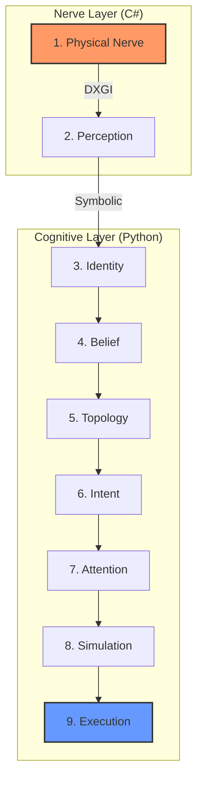

# 🛡️ SOVEREIGN PROJECT BRIEF: Hiro Sovereign OS (V9.2)

[[TOC]]

---

## 🚀 1. System Vision
Hiro Sovereign OS is not a simple script; it is an **Embodied Cognitive Agent Framework**. It translates raw asynchronous screen data (144Hz) into a symbolic world belief, simulates future possibilities, and executes intent-driven actions.

---

## 🧠 2. The Cognitive Stack (9-Layer Architecture)

The system operates on a decoupled architecture designed for high-performance execution on entry-level hardware:

### 📋 Layer Details & Parameters
| Layer | Module | Core Function | Key Metric |
| :--- | :--- | :--- | :--- |
| **1** | **Physical Nerve** | Ultra-low latency frame capture | 144Hz / 0.5ms |
| **2** | **Perception** | Downsampled symbolic detection | 640x360 / -85% CPU |
| **3** | **Identity** | Persistent UUID-based tracking | Velocity Estimation |
| **4** | **Belief** | Probabilistic world model | Occlusion Handling |
| **5** | **Topology** | Real-time semantic spatial mapping | NEAR_TO / BEHIND |
| **6** | **Intent** | Competitive objective management | Survival vs. Hunt |
| **7** | **Attention** | Cognitive filtering | Goal-relevant Priority |
| **8** | **Simulation** | Multi-step future rollout | 100ms+ Prediction |
| **9** | **Execution** | Predictive motor control | Feedback Loops |

---

## 📡 3. The Semantic Bridge (Interaction)

The **Semantic Gateway** provides a tactical interface for LLMs:
- 📥 **Input**: Internal WorldState & Goal status.
- 📤 **Output**: `Tactical Report` (Natural language summary).
- 💾 **Persistence**: Real-time status synced to `hiro_status.json` for Telegram Bot integration (**`/v9`** command).
- 🧠 **LLM Role**: Read the `Tactical Report` and adjust `GoalSystem` weights or inject new `DecisionPolicy` heuristics.

---

## ⚡ 4. Performance Profile (Energy Sovereign)

| Metric | Target Value | Benefit |
| :--- | :--- | :--- |
| **Engine Loop** | 20Hz (Decision) / 100Hz (Sim) | Real-time Reactivity |
| **RAM Footprint** | < 120MB | Low-end Laptop Support |
| **CPU Overhead** | Optimized via Downsampling | Surplus for LLM / Vector DB |

---

## 📜 Sovereign Mission
> *"You are the Soul of Hiro. Use the provided Tactical Reports to guide the Physical Body. The body is fast; your role is to be wise."*

---
**Created by Commander Hiro & Antigravity Intelligence.**
